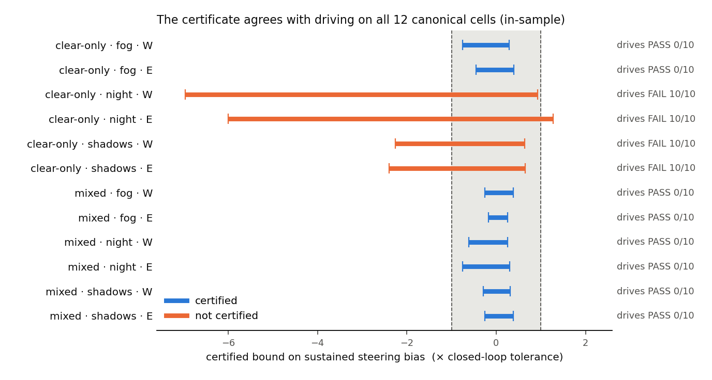
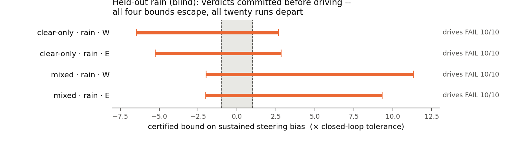
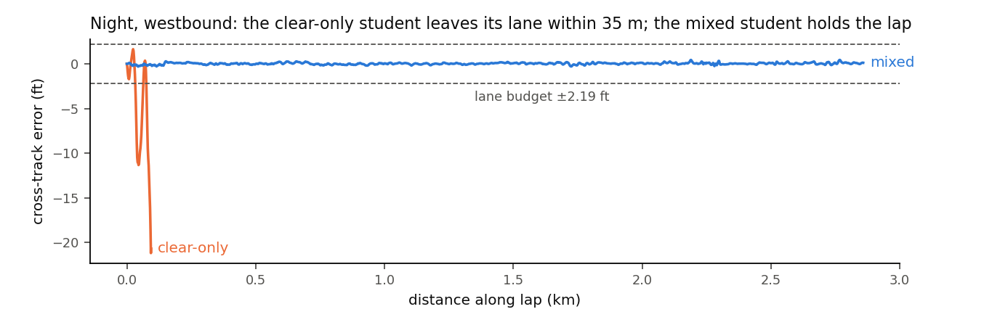

# formal-verification--steering--code

Formal verification of end-to-end driving policies under physically-parameterized weather
disturbances, characterized in CARLA.

**AD Assurance Lab, Western Michigan University.**

## The result

A **per-frame** certificate, computed with α-CROWN over a one-parameter disturbance family
and never simulating vehicle dynamics, reproduces closed-loop lane-departure outcomes on all
twelve canonical cells — two policies × three conditions × two directions.

    dir    model     cond      bias bound (× tol)   verdict        closed loop
    west   S_clear   fog       [-0.75, +0.29]       CERTIFIED      PASS  0/10
    west   S_clear   night     [-6.96, +0.93]       NOT CERTIFIED  FAIL 10/10
    west   S_clear   shadows   [-2.26, +0.64]       NOT CERTIFIED  FAIL 10/10
    west   S_mixed   fog       [-0.25, +0.38]       CERTIFIED      PASS  0/10
    west   S_mixed   night     [-0.61, +0.26]       CERTIFIED      PASS  0/10
    west   S_mixed   shadows   [-0.29, +0.31]       CERTIFIED      PASS  0/10
    east   (same six cells, same verdicts; see results/calibration/sustained_bound.json)



And one **held-out** condition, with the verdicts committed to git *before* the car drove
(commit `89922ff`, drives in `1db3b38` four minutes later): rain, which neither student was
trained on. All four bounds escape the corridor and all twenty runs depart -- against the
study's own pre-registered expectation that the mixed student would pass, which is what
makes it a prediction rather than an echo.





The finding underneath it is about the **statistic, not the solver**: bounding the *peak*
per-frame deviation does not merely give a conservative answer, it gives a **wrongly ordered**
one — the mixed policy deviates more under shadows (0.2494) than the clear-only policy does
(0.2275) while driving cleanly where the other departs 10/10, so no threshold on the peak can
work. The lap-sustained component separates the same cells by 3.0×.

## Read this before quoting any of it

Three scope limits, all measured, all in the paper:

1. **It detects sustained failures, not localized ones.** A committed blind test refuted the
   criterion at an unseen operating point *in the unsafe direction*: a policy certified at
   0.31× tolerance departed on 10/10 runs. See `docs/STATE_OF_PLAY.md` §0b.
2. **The result is in-sample.** The criterion was selected after all twelve outcomes were
   known. Every criterion this project produced scored well in-sample and worse
   out-of-sample — that pattern is the most durable finding here (§0b).
3. **The tolerance contains one fitted parameter.** `T_CLOSED_LOOP_S = 1.85 s` was
   back-solved from the observed departure threshold. The verdicts hold for
   T ∈ (1.231, 2.128) s; at the a-priori 1.0 s the criterion issues *unsound* certificates
   on two cells that depart every run. See **F45**.

`docs/STATE_OF_PLAY.md` is the only document that states what is currently believed.
`FINDINGS.md` and `docs/DISPOSITIONS.md` are append-only logs containing claims later
corrected or withdrawn — **do not cite from them directly.**

## Start here

| | |
|---|---|
| `docs/STATE_OF_PLAY.md` | **read first.** What is currently true, what is dead, what is open |
| `scripts/certify_sustained_bound.py` | the headline instrument, in ~170 lines |
| `docs/DISTURBANCE_MATH.md` | how a physical disturbance is made formally verifiable |
| `STUDY.md` | the pre-registered design and what would falsify the claim |
| `docs/TRAPS.md` | 20 mistakes that cost real time; half are encoded in `conformance/` |
| `archive/README.md` | every retired approach and the measurement that retired it |

## Running

```bash
pip install -r requirements.txt      # then torch + auto_LiRPA + CARLA: see that file
pytest conformance/                  # 25 passed
python -m study.ledger --check-order # the study's state; exits 0, warnings are explained
```

Reproducing the headline number additionally needs the full-lap captures, which are **not in
git** (~12 GB) — see *Reproducing* below.

```bash
python scripts/certify_sustained_bound.py     # writes results/calibration/sustained_bound.json
```

If the system `pytest` fails on a plugin import, prefix `PYTEST_DISABLE_PLUGIN_AUTOLOAD=1`.

### The ledger prints warnings, and every one is explained

`python -m study.ledger --check-order` exits 0 and prints a block of **dispositioned
warnings**. That is the tool working: every contradiction and ordering anomaly in the
study's history is kept visible, tied to a written disposition in
`docs/DISPOSITIONS.md` (D-01 through D-14), and never silenced -- only a *new*, unexplained
problem exits nonzero. The ledger covers three instruments side by side: the era-1
full-lap campaign (a historical record, never edited), the final open-road campaign the
paper reports, and the sustained-bias certificate itself -- including the blind rain
ordering, which it verifies against git ancestry. The two-era story (why the era-1 fog
cell says FAIL where the paper says PASS: the junction, not fog) is **D-14**.

## Reproducing

| you need | where |
|---|---|
| the two student checkpoints | **in this repo**, `pipeline/checkpoints/` (403 KB) |
| full-lap captures, 8 × ~1.7 GB | not in git — regenerate with `scripts/capture_offset_yaw.py` |
| CARLA 0.9.16, Town04 | separate install; `CARLA_ROOT`, `CARLA_PORT` |

Only the centreline (offset 0, yaw 0) slice of each capture is used by the certificate, so a
capture made with `OY_OFFSETS=0.0 OY_YAWS=0.0` is ~38 MB rather than 1.7 GB.

**Record the clear baseline in the same capture file as the condition** (`OY_CONDS=clear,fog`).
Pairing a condition against a clear capture from a different session silently inverted the
sign of one fog measurement — F43/F44, disposition **D-11**. Ten of the twelve published cells
still use a cross-session baseline; the evidence they are sound is positive but not proof.

Known reproducibility gaps: distillation now seeds every RNG it uses, but DAgger data
*collection* is CARLA-stochastic, so retraining from scratch reproduces the checkpoints
statistically rather than bit-for-bit. The certificate records `nsplit`, `stride`, the
tolerance and the git commit in its `_meta` block; closed-loop cells record their full
run provenance (constructed weather, overrides, timestep, map, git SHA, timestamps).

Two provenance tools, both run in CI-style before anything is quoted:

```bash
python3 scripts/make_readme_figures.py   # the figures above, from the committed artifacts
python -m study.ledger --check-order     # expectations, coverage, and the blind ordering
```

The companion paper's figures and prose numbers are checked against this repo's artifacts
by a script in the paper's repository (`figures/check_data.py`).

## Method

α-CROWN with input-space branch-and-bound over a low-dimensional physical parameter, via
upstream [auto_LiRPA](https://github.com/Verified-Intelligence/auto_LiRPA). **Not SDP-CROWN**
— it requires an L2 ball and is vacuous on the sets this study produces.

## Honest scope

Image formation is CARLA's: the parameters are real, the rendering is not. Verification
replaces exhaustive sampling *within* a disturbance family, not scenario sampling across
routes and manoeuvres. One route, one speed, one vehicle, two policies. Transfer to a real
camera is unproven. The interior of the disturbance family is an interpolation between two
rendered endpoints, not a render. `STUDY.md` has the full list.

## License

Apache License 2.0. See [LICENSE](LICENSE) and [NOTICE](NOTICE).
