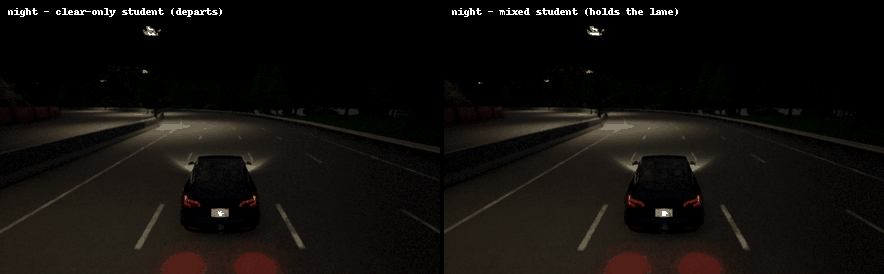

# Proving end-to-end steering in poor visibility

[](LICENSE)
[](pyproject.toml)
[](https://carla.org)
[](https://doi.org/10.5281/zenodo.22101297)
[](https://huggingface.co/datasets/AD-Assurance-Lab/steering-verification-captures)

**A camera-only steering network can pass every test case and still fail in an
intermediate condition.** Test campaigns pick conditions, budgets decide how many get
driven, and the gaps between them are where the risk lives.

Companion code for *Proving End-to-End Steering in Poor Visibility*.
**AD Assurance Lab, Western Michigan University.**

<p align="center">
  
</p>

<p align="center"><sub>Night on the highway. The clear-only network leaves its lane on
every one of six runs, first crossing the budget 40 to 42 m into the route and reaching
28 to 37 ft of cross-track error. The mixed-conditions network never departs and stays
within 0.85 ft.</sub></p>

## What was done

Two small steering networks were trained on each of two roads, a highway and an urban
arterial, both in CARLA: one on clear weather alone and one on clear, fog, night and low
sun. Each was distilled small enough to verify. Then, with no simulator running, bound
propagation reads the weights and computes how far the steering can drift at **every**
weather strength between two captured images: a continuum no test campaign could drive.

It found what the test cases could not. Under fog and under low sun, a network whose
steering error at the captured condition sits well inside safe limits leaves its lane on
every lap, and its worst case lies in between.

The disturbance families are physically parameterized (fog density, sun altitude) and never
balls in pixel space, which would contain physically impossible images and make the safety
claim vacuous.

## Reproducing it

**The certificates need no simulator.** That is the level most readers want, and it runs
on a laptop:

```bash
git clone --depth 1 https://github.com/AD-Assurance-Lab/formal-verification--steering--code
cd formal-verification--steering--code
pip install -e .
python3 scripts/fetch_captures.py            # 641 MB, every file digest-checked
STUDY_MAP=Town06 python3 scripts/verify/certify_town06.py --out /tmp/cert.json
```

`--depth 1` gets the 16 MB you need. A full clone also pulls the study's history, which
is 128 MB. You do not need it to reproduce anything.

Re-driving the closed loop needs CARLA 0.9.16 and a GPU; rebuilding the networks takes
days. All three levels, and exactly what reproduces to what precision, are in
**[REPRODUCING.md](REPRODUCING.md)**.

## Layout

| | |
|---|---|
| `src/steering/config.py` | every number the study runs on, with the ones you want listed at the top |
| `src/steering/verify/` | certification: bounds, captures, scope |
| `src/steering/drive/` | routes, the expert driver, cross-track error, the ledger |
| `src/steering/simulator/` | the CARLA interface, the port lock, condition checks |
| `src/steering/networks/` | the teacher and student networks, and the dataset |
| `src/steering/disturbance/` | the physically parameterized weather families |
| `scripts/verify/` | recompute the certificates, no simulator needed |
| `scripts/capture/` | render the frames the certifier reads |
| `scripts/drive/` | the closed-loop ledger: drive the cells, aggregate, report |
| `scripts/simulator/` | launch, restart and health-check CARLA |
| `scripts/training/` | build the networks: collect, train, DAgger, distil, gate |
| `checkpoints/` | the four shipped policies, 4.8 MB, so nothing has to be retrained |
| `results/highway`, `results/arterial` | every artifact behind a reported number, including each individual lap |
| `routes/` | the two routes, one per road |

The highway is CARLA's Town04 and the arterial is Town06. The code takes the map name in
`STUDY_MAP`; the results are filed under the road.

## Citing

```bibtex
@software{ad_assurance_lab_steering_verification,
  author  = {Ghalan, Menuka and Rodgers, Charles and Asher, Zachary D.},
  title   = {Formal verification of end-to-end steering under
             physically parameterized weather},
  year    = {2026},
  doi     = {10.5281/zenodo.22101297},
  url     = {https://github.com/AD-Assurance-Lab/formal-verification--steering--code}
}
```

## Built on

The bounds come from [auto_LiRPA](https://github.com/Verified-Intelligence/auto_LiRPA),
which implements CROWN and its variants. The certificates here are plain CROWN over an
input-space branch-and-bound; the verifier does the bound propagation and this repository
supplies the disturbance family, the scope and the criterion. `scripts/bootstrap_env.sh`
pins the exact upstream commit, because the package is installed from git rather than a
release.

```bibtex
@inproceedings{xu2020automatic,
  title     = {Automatic perturbation analysis for scalable certified robustness
               and beyond},
  author    = {Xu, Kaidi and Shi, Zhouxing and Zhang, Huan and Wang, Yihan and
               Chang, Kai-Wei and Huang, Minlie and Kailkhura, Bhavya and
               Lin, Xue and Hsieh, Cho-Jui},
  booktitle = {Advances in Neural Information Processing Systems},
  year      = {2020}
}
```

The simulator is [CARLA](https://carla.org) 0.9.16. The captured frames are renderings of
CARLA's own assets and are redistributed under the terms CARLA publishes for them.

## License

Apache License 2.0. See [LICENSE](LICENSE).
