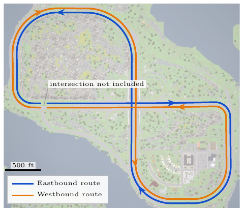
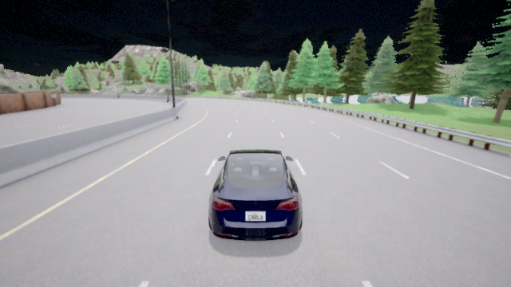
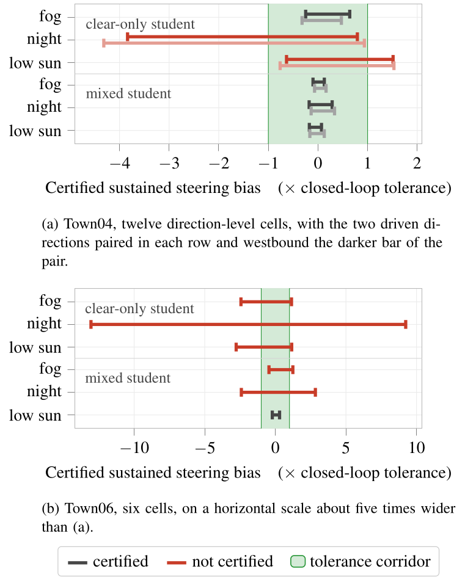
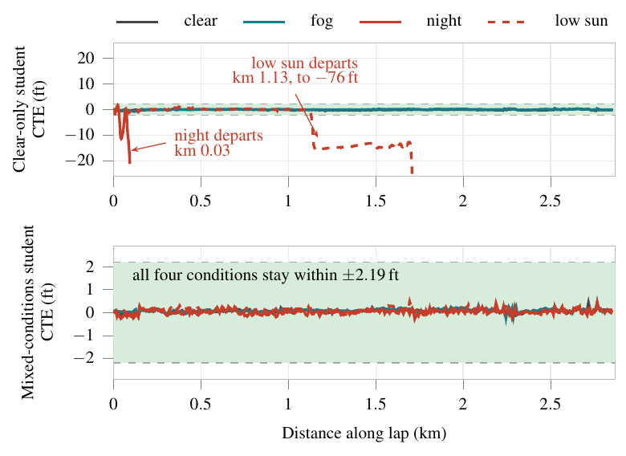

# formal-verification--steering--code

[](LICENSE)
[](requirements.txt)
[](https://carla.org)
[](https://github.com/Verified-Intelligence/auto_LiRPA)

Formal verification of end-to-end steering under physically-parameterized weather,
characterized in CARLA. **AD Assurance Lab, Western Michigan University.** Companion
code for the paper *Proving End-to-End Steering in Poor Visibility* (preprint in
preparation).

Two steering networks — one trained on clear weather, one on clear + fog + night +
low sun — drive a full Town04 highway lap in both directions, then are certified
with α-CROWN over the disturbance family between the rendered endpoints, without
driving. The certificate agrees with closed-loop testing in all twelve cells.

<p align="center">
  
  
</p>

<p align="center">
  
</p>

<p align="center">
  
</p>

<p align="center">
  
</p>

The certificate detects failures that persist along the route; the peak statistic
provably cannot (it misorders the two networks). Scope, caveats, and the fitted
tolerance horizon are in the paper.

## Layout

| | |
|---|---|
| `pipeline/` | CARLA interface, training (BC → DAgger → distillation), evaluation; the two student checkpoints (403 KB) |
| `scripts/certify_sustained_bound.py` | the certificate |
| `scripts/closed_loop_ledger.py` | closed-loop failure rates (≥10 reps, Wilson intervals) |
| `scripts/capture_offset_yaw.py` | full-lap capture rig |
| `results/` | the twelve certified bounds and the eight driven cells the paper reports |

## Reproduce

```bash
pip install -r requirements.txt   # plus torch, auto_LiRPA, and CARLA 0.9.16 (see file)

# 1. closed-loop driving (CARLA server required); the shipped checkpoints are the
#    published students — retraining from scratch is pipeline/train.py -> dagger.py
#    -> distill.py -> dagger_student.py
python scripts/closed_loop_ledger.py --student S_clear_84x28 --condition night

# 2. full-lap captures for verification (only the centreline slice is needed:
#    OY_OFFSETS=0.0 OY_YAWS=0.0, ~38 MB per condition)
python scripts/capture_offset_yaw.py

# 3. formal verification: alpha-CROWN + input-space branch-and-bound over the
#    disturbance family, no simulator -> the twelve certified bounds
python scripts/certify_sustained_bound.py
```

Every number in the paper traces to an artifact in `results/`; the paper repository
carries the checker. The research record behind this artifact — design, findings,
dispositions, retired instruments — lives in this repository's git history.

## License

Apache License 2.0. See [LICENSE](LICENSE).
