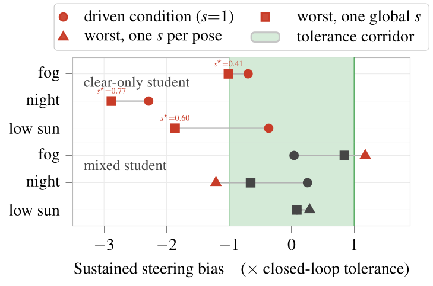
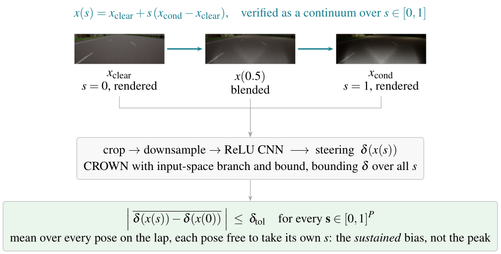
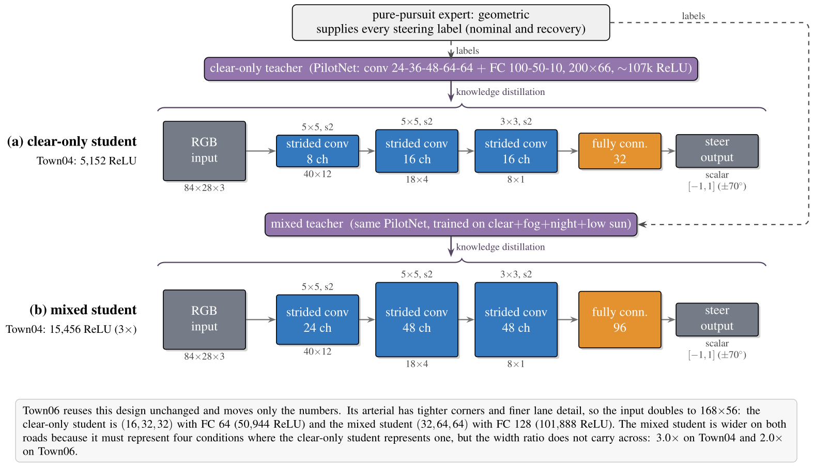
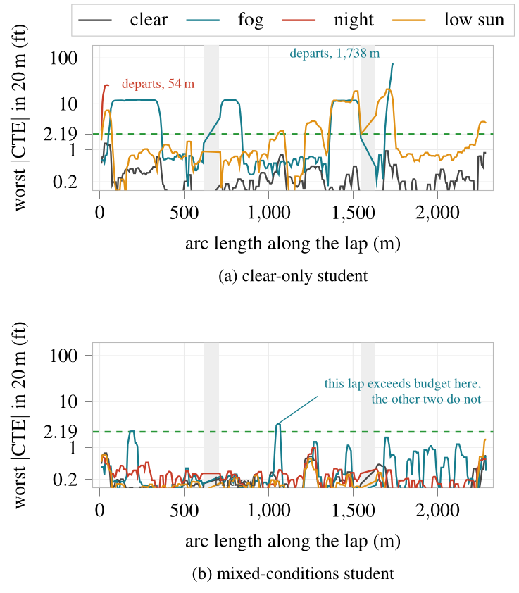

# Proving end-to-end steering in poor visibility

[](LICENSE)
[](pyproject.toml)
[](https://carla.org)
[](https://doi.org/10.5281/zenodo.22101297)
[](https://huggingface.co/datasets/AD-Assurance-Lab/steering-verification-captures)

**A camera-only steering network can pass every test case and still fail in an
intermediate condition.** Test campaigns pick conditions, budgets decide how many get
driven, and the gaps between them are where the risk lives. This is the code and the
evidence behind a study that went looking for what is in those gaps.

Companion artifact for *Proving End-to-End Steering in Poor Visibility*.
**AD Assurance Lab, Western Michigan University.**

---

## The result in one picture

Take a network that fails under fog. Its steering error **at the fog density anyone would
capture and test** sits comfortably inside tolerance — and it leaves the road on every
lap. The worst case is not at either endpoint. It is somewhere in between, and this finds
it in minutes without driving at all.

<p align="center">
  
</p>

The circles are the rendered conditions — what a test campaign measures. The squares are
the worst intensity between clear weather and that condition, found by reading the
network's weights. For the clear-only student under fog and under low sun, checking only
the circle would have cleared a network that departs the lane on every lap.

**Driving alone shows the same shape, with no verifier involved.** A network holds its
lane in clear weather, holds it again in heavy fog, and leaves it at fog densities between
the two on four of six road sections.

## How it works

Two small steering networks are trained per road, one on clear weather alone and one on
clear plus fog plus night plus low sun. Each is distilled to a size that can be verified.
Then, with no simulator in the loop, bound propagation reads the weights and biases and
computes how far the steering can drift across **every** weather strength between two
captured images — a continuum no campaign could drive.

<p align="center">
  
  
</p>

The disturbance families are physically parameterized — fog density, sun altitude — never
balls in pixel space. A pixel ball large enough to contain a night image also contains
physically impossible images, which makes the safety claim vacuous.

## What the certificate says, and what the vehicle does

<p align="center">
  
  
</p>

A cell is certified when the whole bias interval stays inside the tolerance corridor.
Driving the same cells reproduces all twelve direction-level verdicts on the highway. On
the arterial — where the criterion was frozen and the certificate committed before any lap
was driven — agreement is four of five scored cells, with one cell void and one genuine
disagreement. The paper reports that disagreement as the honest boundary rather than
smoothing it over, and the highway agreement is in-sample by construction.

<p align="center">
  
</p>

<p align="center"><sub>Night on the highway. Across the six rebuilt runs the clear-only
student departs every time, and every time at 34.0 m, reaching 27–41 ft of cross-track
error. The mixed student never departs and stays within 1.40 ft.</sub></p>

## Reproducing it

**The certificates need no simulator.** That is the level most people want, and it runs on
a laptop:

```bash
pip install -e .
python3 scripts/fetch_captures.py                # 641 MB, digest-checked
STUDY_MAP=Town06 python3 scripts/certify_town06.py --out /tmp/cert.json
```

Re-driving the closed loop needs CARLA 0.9.16 and a GPU; rebuilding the networks from
scratch takes days. All three levels, and exactly what reproduces to what precision, are
in **[REPRODUCING.md](REPRODUCING.md)**.

## Layout

| | |
|---|---|
| `src/steering/` | the library: simulator interface, routes, networks, disturbance families, certification |
| `scripts/` | everything you run — capture, certify, drive, train, audit |
| `checkpoints/` | the ten shipped networks — six policies, four teachers — 9 MB, so nothing has to be retrained |
| `results/` | every artifact behind a reported number, including each individual lap |
| `data/routes*/` | the two pre-registered routes |
| `PROTOCOL.md` | the frozen study protocol, hash-locked against `PROTOCOL.lock` |

The certificate for each cell was committed to git **before** the corresponding lap was
driven, which is what makes a verdict a prediction rather than a description. That
ordering is verifiable against commit timestamps, and `scripts/audit_repo.py` checks it.

## The research record

This repository is the published artifact: the pipeline, the instruments, and the reported
results. The full research record — pre-registrations, findings, dispositions, retired
instruments and the experiments that did not work — is in this repository's git history,
before the v1.3.0 prune.

## Citing

```bibtex
@software{ad_assurance_lab_steering_verification,
  author  = {{AD Assurance Lab, Western Michigan University}},
  title   = {Formal verification of end-to-end steering under
             physically parameterized weather},
  year    = {2026},
  doi     = {10.5281/zenodo.22101297},
  url     = {https://github.com/AD-Assurance-Lab/formal-verification--steering--code}
}
```

## License

Apache License 2.0. See [LICENSE](LICENSE).
